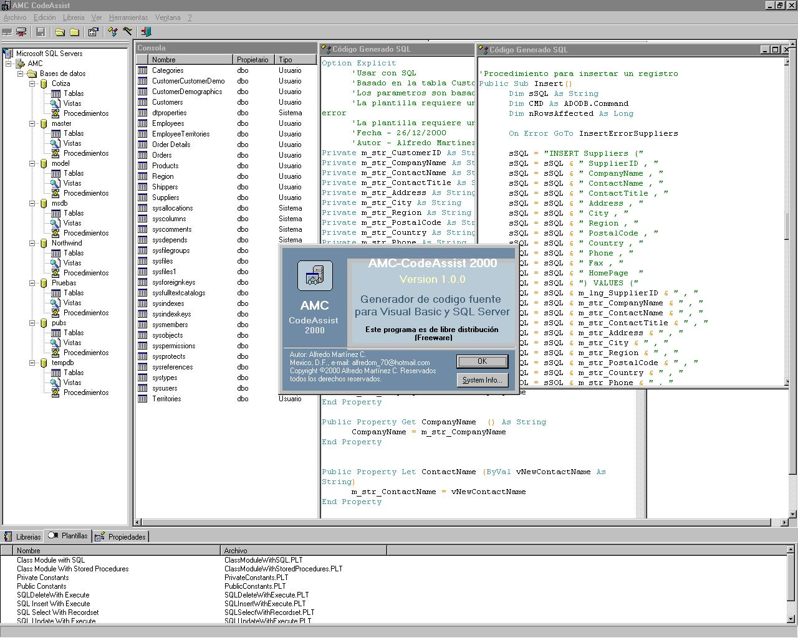



## AMC\-CodeAsist

### Description

Este es un generado de codigo fuente basado en Sheridan Code Assist. contiene un interprete de scripts y reconocimiento de sintaxis.
 
### More Info
 

             |
---                |---
**Submitted On**   |2000-12-26 15:56:34
**By**             |[Alfredo Martinez C\.](https://github.com/Planet-Source-Code/PSCIndex/blob/master/ByAuthor/alfredo-martinez-c.md)
**Level**          |Advanced
**User Rating**    |4.0 (24 globes from 6 users)
**Compatibility**  |VB 5\.0, VB 6\.0
**Category**       |[Complete Applications](https://github.com/Planet-Source-Code/PSCIndex/blob/master/ByCategory/complete-applications__1-27.md)
**World**          |[Visual Basic](https://github.com/Planet-Source-Code/PSCIndex/blob/master/ByWorld/visual-basic.md)
**Archive File**   |[CODE\_UPLOAD1306512262000\.zip](https://github.com/Planet-Source-Code/alfredo-martinez-c-amc-codeasist__1-13885/archive/master.zip)

